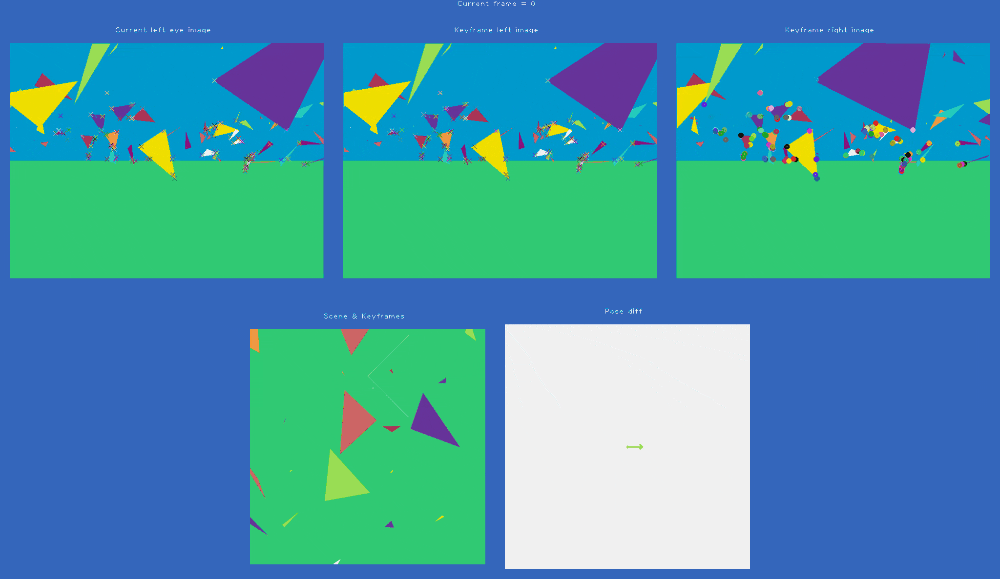

VSLAM
=====

Intro
-----

Here's an easy-to-understand Visual Simultaneous Localization And Mapping (VSLAM) algorithm, on top of
data coming from kinda-easy-to-understand triangle-based scene rendering from scratch.

The VSLAM part of this repo is largely reinterpretation of tutorials presented in an ***excellent*** book 
*"Introduction to Visual SLAM: From Theory to Practice"*. See the associated
[github repo](https://github.com/gaoxiang12/slambook) provided by the authors of the book.
They also generously [provided pdf of the book itself in a realted repo](https://github.com/gaoxiang12/slambook-en/blob/master/slambook-en.pdf).
This is very awesome, and I am grateful for that.

Here is how it looks like on an imagined triangle scene.



There is a bit of normal frontend noise, but it generally works well :)

Installing
----------

I recommend using `pipenv`.

```
python -m pip install pipenv
pipenv --python 3.10   # this assumes that you have python 3.10 installed
pipenv shell
pip install -r requirements.txt
```

To briefly summarize, we depend mostly on `attrs`, `numpy`, `jax` (!), `opencv-python`, `pandas` and `scipy`.
`jax` is not critical and could be done away with in favour of numpy, but it keeps things fast.


Rendering
----------

I made a small triangle rendering library.
This way we fully control the data coming into the algorithm and we get to learn the camera equations
from the "inverse problem" side (rendering is inverse of SLAM in a way).
Below command runs the entry point of the interactive rendering code.

```
pipenv shell
python -m sim.render
```
Sorry it's too slow to feel smooth to humans! It seems we would need to rewrite in c++ to be proper fast.
Jax doesn't like modifying arrays in place.

Experiment with WSAD, QE and arrow keys. Escape to quit.
Change `__main__` to save data. One eye image looks more or less like this:


Here's an older toy render of a cube.


